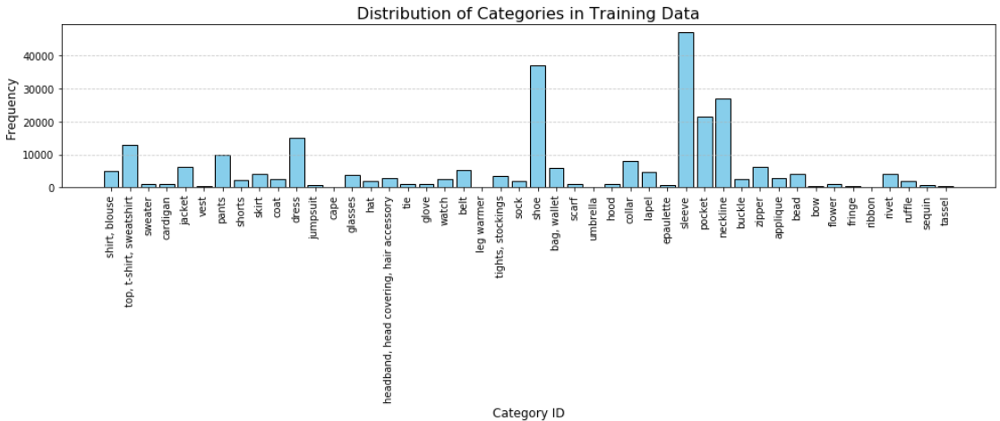

# Fashion Detection API
## Technyx X Maruf


Fashion Detection API is a robust, containerized application that runs MRCNN model fine-tuned on iMaterialist dataset. This README provides instructions for cloning, building, running, and using the API, along with detailed endpoint documentation. Replace the placeholder images as needed.

---

## Table of Contents
1. [Getting Started](#getting-started)
    - [Clone the Repository](#clone-the-repository)
    - [Build Docker Container](#build-docker-container)
    - [Run the Application](#run-the-application)
2. [API Documentation](#api-documentation)
    - [Base URL](#base-url)
    - [Endpoints](#endpoints)
        - [Health Check](#1-health-check)
        - [General Fashion Detection](#2-general-fashion-detection)
        - [Filtered Fashion Detection](#3-filtered-fashion-detection)
        - [Get Output Image](#4-get-output-image)
3. [Additional Information](#additional-information)
    - [Bounding Box Format](#bounding-box-format)
    - [Detection Categories](#detection-categories)
    - [Image Processing](#image-processing)
    - [Confidence Scores](#confidence-scores)
4. [Data Preparation](#data-preparation)
5. [Model Training and Performance](#model-training-and-performance)

---

## Getting Started

### Clone the Repository
Clone this repository using the following command:
```bash
git clone https://github.com/marufahmed/fashion-detection.git
```

### Build Docker Container
Build the Docker container with:
```bash
docker build -t fashion_detection_api .
```

### Run the Application
Run the containerized application:
```bash
docker run -p 8000:8000 fashion_detection_api
```
**Note:** This project requires Intel architecture to run. Using `--platform Linux/amd64` does not work on Apple Silicon.

---

## API Documentation

### Base URL
The application runs at:
```bash
http://localhost:8000
```

### Endpoints

#### 1. Health Check
Check if the API is running.
```http
GET /health
```
##### Response
```json
{
    "status": "healthy"
}
```

---

#### 2. General Fashion Detection
Detect all fashion items in an image.
```http
POST /detect
```
##### Request
- **Content-Type:** `multipart/form-data`
- **Body:**
  - `file`: Image file (supported formats: JPG, PNG)

##### Response Schema
```json
{
    "detections": [
        {
            "class": "string",
            "score": "number (0-1)",
            "bbox": ["array of 4 integers [y1, x1, y2, x2]"]
        }
    ],
    "image_url": "string"
}
```
##### Example Response
```json
{
    "detections": [
        {
            "class": "sleeve",
            "score": 0.927,
            "bbox": [178, 319, 386, 384]
        },
        {
            "class": "neckline",
            "score": 0.737,
            "bbox": [152, 220, 184, 292]
        }
    ],
    "image_url": "output_image.jpg"
}
```

---

#### 3. Filtered Fashion Detection
Detect only sleeves, necklines, and torso garments.
```http
POST /detect-filtered
```
##### Request
- **Content-Type:** `multipart/form-data`
- **Body:**
  - `file`: Image file (supported formats: JPG, PNG)

##### Response Schema
```json
{
    "grouped_detections": {
        "sleeve": [
            {
                "class": "string",
                "score": "number (0-1)",
                "bbox": ["array of 4 integers [y1, x1, y2, x2]"]
            }
        ],
        "neckline": [],
        "torso": []
    },
    "image_url": "string"
}
```
##### Example Response
```json
{
    "grouped_detections": {
        "sleeve": [
            {
                "class": "sleeve",
                "score": 0.927,
                "bbox": [178, 319, 386, 384]
            }
        ],
        "neckline": [
            {
                "class": "neckline",
                "score": 0.737,
                "bbox": [152, 220, 184, 292]
            }
        ],
        "torso": []
    },
    "image_url": "filtered_output_image.jpg"
}
```

---

#### 4. Get Output Image
Retrieve the processed image with annotations.
```http
GET /outputs/{filename}
```
##### Parameters
- `filename`: Name of the output image file (returned in `image_url` from detection endpoints)

##### Response
- **Content-Type:** `image/jpeg` or `image/png`
- **Body:** Binary image data

---
#### `/detect` output visualization
*Detects All Categories*


#### `/detect/filtered` output visualization
*Detects Sleeve, Neckline and Torso*


## Additional Information

### Bounding Box Format
The `bbox` array contains coordinates in the format `[y1, x1, y2, x2]` where:
- `(x1, y1)` is the top-left corner
- `(x2, y2)` is the bottom-right corner

### Detection Categories
The filtered detection endpoint focuses on three specific categories:
1. Sleeves (garment parts)
2. Necklines (garment parts)
3. Torso items (upper body supercategory)

### Image Processing
- Input images are automatically resized to maintain aspect ratio
- Images are fitted within the model's required dimensions
- Original aspect ratio is preserved through padding

### Confidence Scores
- Scores range from 0 to 1
- Higher scores indicate greater confidence in the detection
- Typically, scores above 0.5 are considered reliable detections

# Data Preparation
## Training Dataset
- Total training images: 36156
- Total training segments (annotations): 264949

## Validation Dataset 
- Total validation images: 9039
- Total validation segments (annotations): 66264


# Model Training and Performance
The best model was trained on NVIDIA P100 GPU on Kaggle
## Training Configuration
```
GPU_COUNT = 1
IMAGES_PER_GPU = 4 # ideal for a single NVIDIA P100
BACKBONE = 'resnet50'
RPN_ANCHOR_SCALES = (16, 32, 64, 128, 256)
STEPS_PER_EPOCH = 1000
VALIDATION_STEPS = 200
```
Training Output for the best model
```
Epoch 6/6
1000/1000 [==============================] - 1185s 1s/step - loss: 2.0023 - rpn_class_loss: 0.0713 - rpn_bbox_loss: 0.8464 - mrcnn_class_loss: 0.4019 - mrcnn_bbox_loss: 0.3297 - mrcnn_mask_loss: 0.3529 - val_loss: 1.8960 - val_rpn_class_loss: 0.0596 - val_rpn_bbox_loss: 0.7142 - val_mrcnn_class_loss: 0.4239 - val_mrcnn_bbox_loss: 0.3393 - val_mrcnn_mask_loss: 0.3590
CPU times: user 36min 21s, sys: 3min 19s, total: 39min 40s
Wall time: 1h 21min 16s
```


- Further details on data preparation and training can be found on the [Notebook](notebook/technyx-maruf.ipynb).
